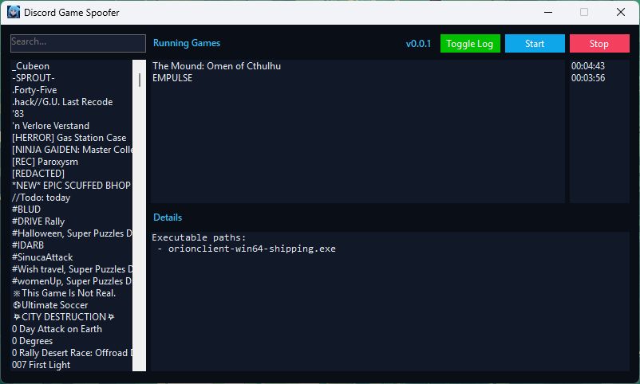

# Discord Game Spoofer

A simple Windows utility for spoofing Discord-detectable games, mainly built to help spoof Discord Quests without needing to launch or install the actual game.

## Screenshot

## Features

* Spoof Discord Quests by simulating supported games
* Search through Discord-detectable games
* Start and stop spoofed game processes
* Track how long each spoofed game has been running
* View executable details for selected games
* Built-in update check
* Simple Windows Forms interface

## Download

Grab the latest build from the [Releases](https://github.com/devAxri/Discord-Game-Spoofer/releases) page.

## Usage

1. Open Discord Game Spoofer.
2. Wait for the detectable games list to load.
3. Search for the game required by the Discord Quest.
4. Select the game.
5. Click **Start**.
6. Keep it running until the quest requirement is completed.
7. Click **Stop** when you are done.

## Notes

This project is not affiliated with Discord. Use it responsibly and at your own risk.

## Contributing

Pull requests are always welcome. Feel free to open an issue for bugs, suggestions, or improvements.
